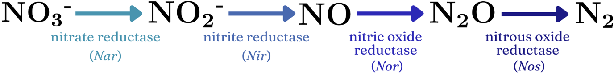
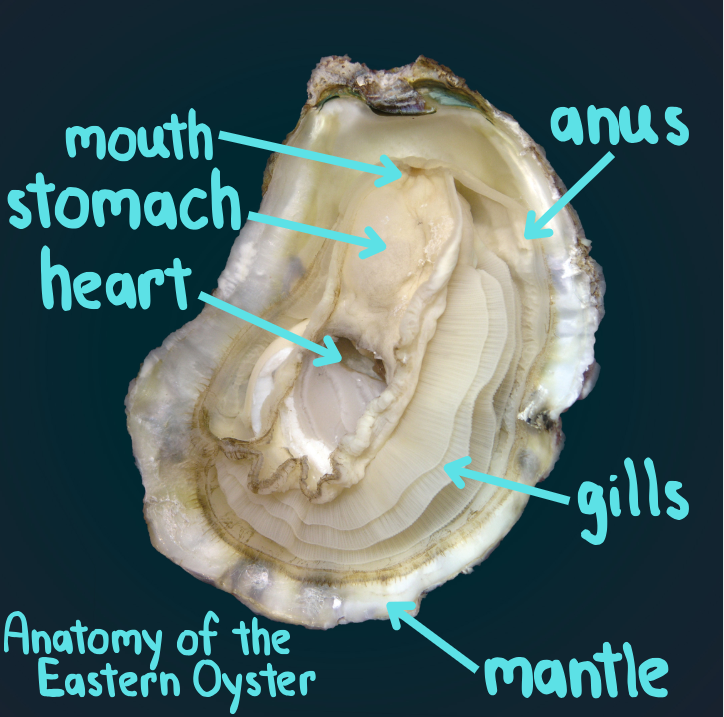

```{r setup, include=FALSE}
knitr::opts_chunk$set(echo = TRUE)
```

# Introduction to the microbial world

In a narrative that usually centers around plants, microorganisms are the unsung heroes of primary production. They work on a scale we cannot see, but the effects of their cumulative efforts are impossible to miss. For instance, half of the oxygen in each breath we take has been produced by oceanic microbes [@pomeroy]. Take a breath. (Thanks microbes!)

Let's start by meeting the three domains of life: Bacteria, Archaea, and Eukarya. In the classification system (domain, kingdom, phylum..., species), domain is the broadest level of distinction. As humans, we belong to the domain Eukarya, along with all other organisms whose cell(s) have genetic material enclosed in membrane-bound nuclei. In other words, in the most basic delineation between life forms present on Earth, we, in all of our complexity, are grouped with plants, fungi, and many microbial species (including some single-celled microbes), while the two remaining categories are not only exclusively microbes, but exclusively prokaryotic[^1] microbes.

[^1]: Prokaryotes: Unicellular microbes with free-floating genetic material in their cytoplasm. They can have organelles, like ribosomes (which all organisms have) or flagella (little extracellular hairlike-structures that enable movement for cells), but they do not have membrane-bound organelles. A prokaryotic cell is like DNA/RNA-cytoplasm soup.

There is incredible biodiversity and functional diversity in the microbial world. Our genus (*Homo*) contains our species (*Homo sapien*) and our extinct primate ancestors (ex. *Homo erectus*). Compare this to the bacterial genus *Streptococcus*, which includes bacteria that ferment milk into cheese and yogurt, live in soil, populate and help regulate several of our organ systems, and can cause strep throat and scarlet fever–among other bacterial infections. All of this within one clade of bacteria.

Instead of performing metabolic pathways from start to finish, like how in our digestive systems food is passed from mouth to esophagus to stomach to small intestine, etc., microorganisms are reliant on each other to achieve comparable biological processes. Take a look at the denitrification step of the nitrogen cycle, which–among other applications–is facilitated by microbial communities in the marine sediments associated with oyster farms: nitrate (NO~3~^-^) is converted to nitrite (NO~2~^-^) which is converted to nitric oxide (NO) and then to nitrous oxide (N~2~O) and finally to dinitrogen (N~2~). The diagram below shows the equation for denitrification, as well as the enzyme that catalyzes each step of the pathway (ex. nitrate reductase) and the gene responsible for that particular enzyme (ex. *Nar*) [@denitrif] . I depict denitrification as a linear process, although it is only one piece of the cyclical way nitrogen flows through ecosystems–a.k.a. the nitrogen cycle.

{width="624"}

Each microorganism in this pathway has a specific enzyme that catalyzes one particular reaction in the sequence, with the collective result of denitrification.[^2] Dr. Lawrence Pomeroy describes such microbial community behaviors as "external digestive processes [which] provide shared benefits for motile bacteria" [@pomeroy]. Dr. Farooq Azam simplifies this further, calling microbial communities the "ultimate swimming stomachs" [@pomeroy].

[^2]: More on this later. Denitrification is an important aspect of the role that sediment microbes in oyster beds play as water purifiers.

While the typical depiction of the food chain is a pyramid with plants at the base, topped by primary, secondary, and tertiary consumers–much of the available energy in our food webs derives from microbes. The microbial loop begins with photosynthetic bacterioplankton (i.e. bacteria and archaeans that drift through the water column) [@pomeroy]. Much like the photosynthetic process that we visualize occurring in plant life, these bacterioplankton take in sunlight energy (and sometimes heat energy; this process is known as chemosynthesis) to form organic compounds from inorganic compounds and moluecules [@pomeroy]. One example of the microbial loop could look like this: bacterioplankton are eaten by microflagellates (less than 0.002 millimeters big), who are eaten by ciliates (ex. paramecium, usually 0.02-0.2 millimeters), who are eaten by copepods (1-2 millimeters, typically) and mezozooplankton (mid-size animal plankton, 0.2-20 millimeters). It is at this point that fish larvae enter the picture as predators and the food chain continues onto a macroscopic scale. However, sometimes the grand microbial loop is short-circuited; organisms like oysters and krill are filter-feeders, casting out mucus nets and capturing a wide range of microorganisms as they pump seawater through their gills. Connecting the so-called "end" of the microbial loop back to its "beginning," some microbial species break down decaying organisms and detritus, returning matter back to the water column in the form of minerals. These minerals may become organic compounds, thanks to photosynthetic organisms, like our friend, the bacterioplankton.

In summary, microbes are diverse and abundant. Their community actions provide us with nutrients we need, and they provide the ecosystems we are reliant upon with necessary nutrients. So when we talk about the factors at play regulating ecological systems, when we talk about the cycling of nutrients between earth, water, sky, and us, it does us well to acknowledge that the drivers of biological processes are microorganisms. It's a microbial world; we're just living in it.

# Introduction to oyster farming

As we face the deleterious ecological impacts of current industrial and agricultural production methods, oyster aquaculture has been proposed as part of a food system reimagined to have greater sustainability. Not only does oyster cultivation bypass common agricultural issues like land scarcity; farming oysters can provide benefits to the health of the marine ecosystems to which they are native. These potential benefits include enhanced water quality, habitat provision to other marine species, and storm surge protection [@stevens2024].

```{r chunkname, echo = FALSE, outwidth = "65%", out.extra = 'style="float:right; padding:10px"'}
```

[{width="208"}](https://www.mdsg.umd.edu/lesson-plans/eastern-oyster-education)

(\^\^\^need help getting text to wrap here.)

Oysters are filter-feeders. They filter \~50 gallons of seawater per day, taking in algae and large plankton through their gills while smaller plankton and water pass through. The organic matter retained by the oyster is then either ingested, passing through the oyster's digestive tract to be excreted as feces, or rejected by the oyster, wrapped in a mucosal lining and deposited into the sediment as pseudofeces.

# Theory #1: Oysters enhance the biodiversity and composition of microbial communities in the seafloor.

Oysters themselves filter water by taking in plankton while seawater passes through their gills, however, the perhaps greater source of denitrification in the relationship between oysters and their environment is the microbial communities in their biodeposits (poop). The abundance of urea and ammonia increases microbial growth. Most abundant in these samples were proteobacteria, firmicutes, bacteriodetes, and actinobacteria. Notably, these are all denitrifiers. Some studies showed underwhelming changes to the microbial community in the presence and absence of oyster farming. The one paper on different methods within the Mass Bay (I think it was the Northeastern paper?) found that hanging oysters (grown suspended in the water column) did not impact the soil communities as the oysters were not in contact with the ground. I think there was a study that said older oyster beds had different microbiomes compared to younger ones, measured at year 3, 5, and 7. One paper took into consideration the potential for pathogenic microbes to humans coming form oysters. This paper (#5) found that *Vibrio* species were found in the oyster sediments (*Vibrio* being associated with food-borne illnesses stemming from seafood). However, the *Vibrio* were not the pathogenic strains. The *Vibrio* present in the samples were determined to not be harmful to human health.

Oysters promote biodiverse microbial communities by providing the microbes in the marine sediments with diverse nutrients. Some bacteria species (some denitrifiers?) need trace metals to survive. Oysters provide these to the sediment.

Although it may be easier to understand that oysters themselves are the big denitrifiers, one of the papers argue that the sediment microbes are doing more of the work. Similarly to how there is emphasis in agriculture on creating living soils, on soil as a community that pulls in CO2 from the atmosphere instead of just seeing plants as the main carbon sinks, the marine floor can be seen as a living sediment, where decaying matter is broken down by microbes for the nutrients to be sequestered or recycled.

# Theory #2: Oysters stimulate increased denitrification by sediment microbiota.

Oyster sediment microbes boost the recycling, cycling, and sequestering of many nutrients in the water column, including nitrogen, phosphorous, and silicon. This can help to combat eutrophication and climate change. Industrial and agriculture production often releases excess nutrients, like the three mentioned above, into bodies of water in the form of fuel, fertilizer, and waste run-off. The papers contradict each other with how pronounced this impact is. Some did not even find the difference in eutrophication to be statistically significant. I am curious how they separate the impact of microbes living in and on oysters from those in the sediments. Just a thought. Sediment microbes, like actinobacteria and proteobacteria are part of the denitrification process.

Here's the pathway: nutrient loading on aquatic system - probably from anthropogenic activity. Then, this stimulates an increase in the abundance of many photosynthetic organisms, like cyanobacteria. All the time, decaying matter and detritus is falling through the water column in the form of marine snow. When oysters "catch" plankton and other microbes and algae, they are pulled out from the water column, boosting water clarity. The seafloor is, ideally covered in decay and also microbes. It is a place of regeneration, of recycling. When sediment microbes take in nitrogen paired with organic material (usually it will be in the form of ammonia or urea, although neither of those are organics?? But are they just with carbon anyway?) microbes break the bonds between nitrogen and hydrogen, returning hydrogen to the water column? At some points, our nitrogens in the process of denitrification are paired with oxygens but the oxygens are eventually returned to the water column. Close to the end of the process of denitrification, nitrous oxide is created. Nitrous oxide is a harmful greenhouse gas, however, the amounts released from sediment denitrification are very small. The Fulweiler meta-analysis suggests that the amount of nitrous oxide released is negligable. This would be a good place to put the Ray and Fulweiler nutrient flux diagram.

Oyster poop microbes remineralize unstable nitrogen compounds (urea, ammonia, nitrate, nitrite, nitric oxide, nitrous oxide), returning them to the water column as N~2~. Diatom nitrogen makes up like 70% of our atmosphere and gas rises so a lot of the N~2~ is recycled back into the air. Kind of cool that we are all breathing matter that had its energy spent and has been recycled billions of time. From death back unto life, or something like that.

So to sum it up, oyster sediment bacteria improves water quality and combat eutrophication. Now I am realizing that I need to learn more about how they actually combat eutrophication and mitigate global warming. I think I've mentioned sequestering, but do they really sequester? Maybe I'm getting carbon cycle and nitrogen cycle confused.

## Summary of Ray & Fulweiler paper, "Meta-analysis of oyster impacts on coastal biogeochemistry"

Oyster aquaculture increases the cycling of nitrogen in marine systems by stimulating denitrifying bacteria and archaea.This improves water quality, with the trade-off of releasing a small amount of nitrous oxide (N~2~o) into the atmosphere [@ray2021].

Testing another citation [@feinman2018].

## Citations
