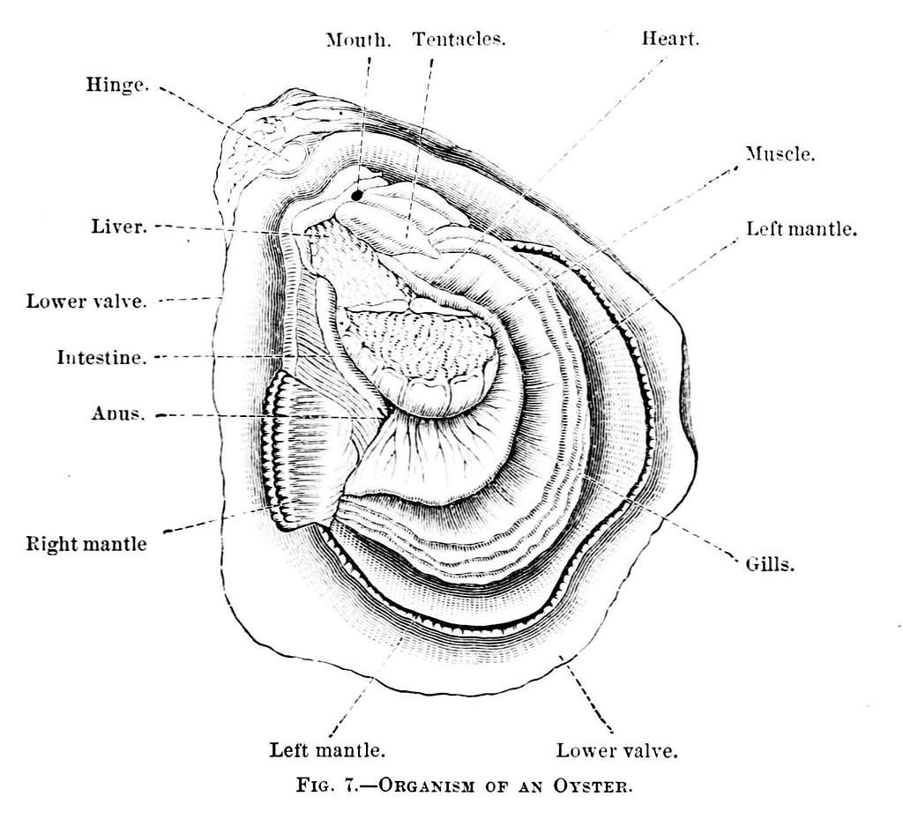

```{r setup, include=FALSE}
knitr::opts_chunk$set(echo = TRUE)
```

# Introduction to the microbial world

In a narrative that usually centers around plants, microorganisms are the unsung heroes of primary production. They work on a scale we cannot see, but the effects of their cumulative efforts are impossible to miss. Half of the oxygen in each breath we take has been produced by oceanic microbes [@pomeroy]. [But who learned that in high school Biology?] \<- (Don't love this)

Let's start by meeting the three domains of life: Bacteria, Archaea, and Eukarya. In the classification system (domain, kingdom, phylum..., species), domain is the broadest level of distinction. As humans, we belong to the domain Eukarya, along with all other organisms whose cell(s) have genetic material enclosed in membrane-bound nuclei. In other words, in the most basic deliniation between life forms present on Earth, we, in all of our complexity, are grouped with plants, fungi, and many microbial species (including some single-celled microbes), while the two remaining categories are not only exclusively microbes, but exclusively prokaryotic[^1] microbes.

[^1]: Prokaryotes: Unicellular microbes with free-floating genetic material in their cytoplasm. They can have organelles, like ribosomes (which all organisms have) or flagella (little extracellular hairlike-structures that enable movement for cells), but they do not have membrane-bound organelles. A prokaryotic cell is like DNA/RNA-cytoplasm soup.

[Could talk more about bacteria and archaeans, as understanding them seems pertinent to understanding microbiology, in my opinion]

Instead of performing metabolic pathways from start to finish, like how in our digestive systems food is passed from mouth to esophagus to stomach to small intestine, etc., microorganisms are reliant on each other to achieve comparable biological processes. Take a look at the denitrification step of the nitrogen cycle, which–among other applications–is facilitated by microbial communities in the marine sediments associated with oyster farms: nitrate (NO~3~^-^) is converted by \_\_ to nitrite (NO~2~^-^)\_\_\_ which is converted nitric oxide (NO) by \_\_\_\_ and then to nitrous oxide (N~2~O) by \_\_\_\_\_ and finally to dinitrogen (N~2~) by \_\_\_\_\_\_. Each microorganism in this pathway has a unique enzyme that catalyzes one particular reaction in the sequence, with the collective result being denitrification.[^2] Dr. Lawrence Pomeroy describes such microbial community behaviors as "external digestive processes [which] provide shared benefits for motile bacteria" [@pomeroy]. Dr. Farooq Azam simplifies this further, calling microbial communities the "ultimate swimming stomachs" [@pomeroy].

[^2]: More on this later. Denitrification is an important aspect of the role that sediment microbes in oyster beds play as water purifiers.

[Something to smooth transition between paragraphs here. And need to go back and fill in microbes' species.]

When we talk about the factors at play regulating ecological systems, when we talk about the cycling of nutrients between earth, water, sky, and us, it does us well to acknowledge that the drivers of biological processes are microorganisms. It's a microbial world; we're just living in it.

# Introduction to oyster farming

As we face the deleterious ecological impacts of current industrial and agricultural production methods, oyster aquaculture has been proposed as part of a food system reimagined to have greater sustainability. Not only does oyster cultivation bypass common agricultural issues like land scarcity; farming oysters can provide benefits to the health of the marine ecosystems to which they are native. These potential benefits include enhanced water quality, habitat provision to other marine species, and storm surge protection [@stevens2024].

[{width="289"}](https://boudewijnhuijgens.getarchive.net/amp/media/psm-v06-d025-organism-of-an-oyster-f4fc6e)

```{r chunkname, echo = FALSE, outwidth = "65%", out.extra = 'style="float:right; padding:10px"'}
```

(\^\^\^need help getting text to wrap here.)

Oysters feed by filtering particulate organic matter (POM), like algae and seawater (\~50 gallons each day) and

are filter-feeders. [50 gal or \~200 L seawater per day] They suck water through their gills [insert diagram of oyster], filtering out larger (?) plankton and algae while seawater passes through. What particulate matter they digest is transferred to the sediment as feces, while some particulate matter is not digested and gets wrapped in mucus and deposited as pseudofeces. The particulate matter (rename to avoid plaigarism) -\> feces or pseudofeces

are filter-feeders. They suck water through their gills, filtering out larger (?) plankton and algae while seawater passes through.

# Theory #1: Oysters enhance the biodiversity and composition of microbial communities in the seafloor.

# Theory #2: Oysters stimulate increased denitrification by sediment microbiota.

## Summary of Ray & Fulweiler paper, "Meta-analysis of oyster impacts on coastal biogeochemistry"

Oyster aquaculture increases the cycling of nitrogen in marine systems by stimulating denitrifying bacteria and archaea.This improves water quality, with the trade-off of releasing a small amount of nitrous oxide (N~2~o) into the atmosphere [@ray2021].

Testing another citation [@feinman2018].

## Citations
