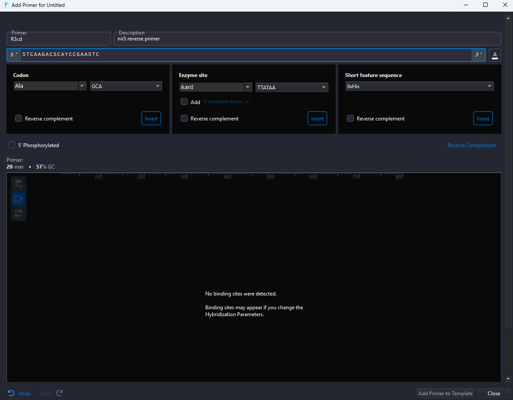
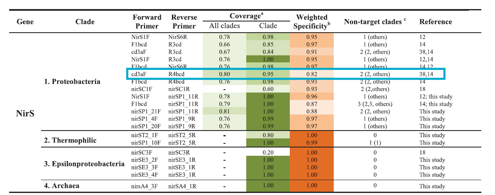
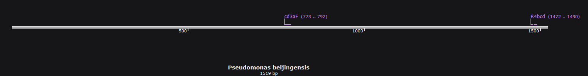
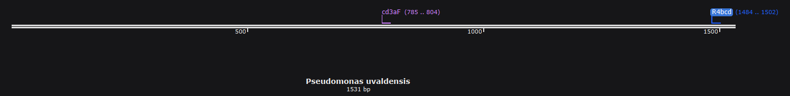

```{=html}
<style>
pre code, pre, code {
  white-space: pre !important;
  overflow-x: scroll !important;
  word-break: keep-all !important;
  word-wrap: initial !important;
}
</style>
```
```{r setup, include=FALSE}
# For width of code chunks and scroll bar 
options(width=250)

knitr::opts_chunk$set(eval = TRUE, 
                      echo = TRUE, 
                      include = TRUE,
                      warning = FALSE,
                      collapse = FALSE,
                      message = FALSE,
                      dpi=200, dev = "png",
                      engine = "R", # Chunks will always have R code, unless noted
                      error = TRUE,
                      fig.path="images/",  # Set the figure options
                      fig.align = "center") 
```
# Introduction

Hello welcome to my laboratory notebook! This document will serve as my electronic notebook for my wet lab work while I am with the Schmidt Lab during my New Visions internship.

# February

### 2/11/2025

#### Purpose

Learning how to pipette from Sophia

#### Results

Pipetting was successful! I can pipette and will be ready to begin PCR either next week or in the distant future after my February break.

# March

### 3/6/2025

#### Purpose

-   Learning PCR from Sophia

Today we will just perform PCR. We will save the gel electrophoresis for
another day.

I. Samples to be thermocycled for PCR

|             |                |                  |            |                             |         |           |                      |                            |               |                  |
|-------------|----------------|------------------|------------|-----------------------------|---------|-----------|----------------------|----------------------------|---------------|------------------|
| **Tube \#** | **Box Number** | **Box Location** | **DNA_ID** | **Sample_ID**               | **DNA** | **Water** | **DNA conc (ng/ul)** | **Final_Vol (DNA+ water)** | **Final_Con** | **Nanograms_in** |
| 1           | 7              | C5               | SR_D098    | AAI_EXP_20230511_205_FP_BW1 | 1       | 10        | 50.5                 | 10                         | 5.05          | 50.05            |
| 2           | 7              | G7               | SR_D120    | AAI_EXP_20230609_215_FP_BW1 | 1       | 10        | 19.3                 | 10                         | 1.93          | 19.3             |
| 3           | 13             | C9               | SA_D035    | AAE_EXP_20240821_128_SD_1   | 1       | 10        | 47.6                 | 10                         | 4.76          | 47.6             |
| 4           | blank          |                  |            |                             | 1       | 10        |                      |                            |               |                  |

then we will need to dilute the DNA to 0.5ng/ul to ensure the
concentration is standard across all samples.

| **D N A_ID** | **Samp l e_ID**                     | DNA | Water | DNA conc ( ng/ul) | Fi n al_Vol (DNA+ water) | Fi n al_Con ( ng/ul) |
|--------------|-------------------------------------|-----|-------|-------------------|--------------------------|----------------------|
| S R_D098     | AAI_EX P \_20230 5 11_205 \_ FP_BW1 | 1   | 100   | 50.5              | 101                      | 0.5                  |
| S R_D120     | AAI_EX P \_20230 6 09_215 \_ FP_BW1 | 1   | 37.6  | 19.3              | 38.6                     | 0.5                  |
| S A_D035     | AAE\_ E XP_202 4 0821_1 2 8_SD_1    | 1   | 94.2  | 47.6              | 95.2                     | 0.5                  |

D. These are the amounts used of PCR mix.

+-------------+----------+--------------------+--------------------+
| **PCR Mix** | uL / rxn | \# rxns (not using | total (25ul total  |
|             |          | multichannel)      | mix)               |
|             |          |                    |                    |
|             |          |                    | aka 15 MM + 10 DNA |
+-------------+----------+--------------------+--------------------+
| KAPA        | 12.5     | 7                  | 87.5               |
+-------------+----------+--------------------+--------------------+
| F (MS1)     | 0.5      | 7                  | 3.5                |
+-------------+----------+--------------------+--------------------+
| R (MS2)     | 0.5      | 7                  | 3.5                |
+-------------+----------+--------------------+--------------------+
| Water       | 1.5      | 7                  | 10.5               |
+-------------+----------+--------------------+--------------------+
| DNA         | 10       | 7                  | (70 total but dont |
|             |          |                    | add to MM)         |
+-------------+----------+--------------------+--------------------+

for the negative control we also did 15 ul MM + 10 ul of water for a
total volume of 25ul. The samples were also 15ul MM + 10 ul of template
DNA

E. Thermocycler Conditions:

-   3 min \@ 95C

-   30 sec \@ 95C

-   30 sec \@ 50C

-   30 sec \@ 72C

-   24X repeats

-   5 min \@ 72C

This is using the il_adapt protocol

We are letting the samples be processed in the thermocycler and I will
put them into the fridge labelled so that we can complete the gel
electrophoresis next time (feb break will delay this)


### 3/?/2025
#### Sophia and I had our second session working on PCR. We made a gel this time! It did not come out clearly, but it was okay for practice.

### 3/?/2025
#### Sophia taught me how to  perform serial dilutions and use a multi-channel pipette. We practiced using water and a dye.

# April

### 4/8/2025
#### Choosing primers and gBlock

#### **Primer set #1: cd3aF** and **R3cd**

#### cd3aF (GTSAACGTSAAGGARACSGG, annealing temp = 49.7)

#### R3cd (GASTTCGGRTGSGTCTTGA, annealing temp  = 51.5)

---

First I tested cd3aF and R3cd, as this pair was suggested by [Throback
(2004)](https://pubmed.ncbi.nlm.nih.gov/19712290/). **cd3aF and R3cd
paired to my reference, *pseudomonas aeruginosa*, from NCBI.** The
**reverse primer did not pair with my next test** Pseudomonas,
*pseudomonas citrulli*, which had an 88% query cover and 84% identity on
NCBI. My third trial, *Pseudomonas beijingensis* (89% query cover, 83%
identity), paired with the forward primer again, but did not with the
reverse primer; this time, it initially worked and I ran into trouble
when I tried to "reverse complement" the sequence.

{width="5in"}

#### Primer set #2: cd3aF and R4bcd

##### R4bcd (CGTTGAAYTTRCCGGTSGG, annealing temp = 54.2)

---

This is a set I got from [Bonilla-Rosso et al.,
2016](https://www.nature.com/articles/srep39208):{width="6in"}

#### *Pseudomonas aeruginosa*


Okay... this looks fine.

#### *Pseudomonas citrulli*


#### *Pseudomonas beijingensis*



Okay!

#### ***Pseudomonas uvaldensis*** **(89% query cover, 79% identity)**



Let's go!!

---

#### To sum it up:

-   I will be using **cd3aF** and **R4bcd** as my primers for *nirS*
    qPCR.

-   gBlock - ***Pseudomonas aeruginosa***:

    -   TCAGTACACGTCGTGCTGGGTGTTGTAGACGTTGAACTTACCGGTCGGGGTGATCAGCCGCGGGTCCTTG
        ACCACGGCCTTGAGCTTCAGGGTCTTGTCGTCCACCACCACCAGCGCGGAGCTGTCGTTCTTGCCGTTCC
        ACACCGAGAACCAGACTTCATCGCCGCGCTTGTTGTACTCGGGCTGCACCACCCGCTTGGCGCCTTCGCC
        GAGATCGGCCCATTCGGCGATCGGCAGCACCTGGTACTTGGCGTCGAGGTTCTTCAGGTCGAACACCGCG
        ACGCTCTGGCTGATCCTGGCGTCGGGGTTGAAGGTGGTGTCGACGTAGAGGTGCGAGGACTTCGGATGGG
        TCTTGATGAACAGCGAGCCGCCGCCCTGGCCCTGTAGTTCGGCGACTTTCTTCCAGGCGTACTGCGGATG
        GTTCTTCGGATCGGTGCCGATCAGCGAGATGCTGCCGTCGCCCAGGTGGCTGGTGCTCCACACCGGGCCG
        TACTTGGGATGCACGAAGTTGGCGCCACGCCCCGGGTGCGGGGTCTTGCCGACGTCGACCAGGGCCGACA
        GGCGACGGTCCTTGGAGTCGATCACGGCAACCTTGTTGGAGTTGTTGGCGGCGGTCATGAAGTAGCGGTG
        GCTGCTGTCCCAGCCGCCGTCGTGGAGGAACGGCGCCGCACCGATGCTGGTGACGGTGAGGTTGTCGATA
        TCCTTGTAGTTGACCAGCAGGACCTTGCCGGTCTCCTTCACGTTGACGATGAACTCGGGGTGCTCGTGGG
        AGGCGATGATCGCCGCCACGCGCGGTTCCGGGTGGTAGGTCTGGGTGTCTACGGTCATGCCGCGGGTGGA
        GACGATCTGCTTCGGTTCCAGGGTCTCGCCGTCCATGATCGCGAACTGCGGCGGCCAGTAGGCGCCGGCG
        ATGGTGTAGCGGTCCTCGTAGCCCTTGAACTTGGAGCTTTCCACCGAGCGCGCCTCGATGCCGATCTTGA
        TCTCGGCGACCTTGGTCGGCTCCTTGGCCCACAGGTCGATCATGTCGATCCGCGCGTCGCGGCCGATCAC
        CAGCAGGTAGCGGCCGGAAGCGGACATCCGCGAGATATGCACGGCATAGCCGGTATCGATGACCTTGACG
        ATCTTCTTGCTGTCGCCGTCGACCAGGGCGATCTGCCCGGCGTCGCGCAGGGTCACCGAGAACAGGTTGG
        GCAGGTCGAGGTCGTTGAGCTGTTTCTTCGGCCGGTCCTCCGGCTTCACCAGCACCTTCCACGATTCGCG
        CATCTCCGGCATGCCCCACTCCGGCGGTTGCGGCGGGGTGTGCTGGATGTACTTGGCCATCAGGGTGATC
        TGTTCCTTGCTCAGCTCGCCGGAGCTGCCCCAGTTCGGCATGCCCAGCGGGGTGCCGTAGGTGATCAGCG
        CTTCCAGGTATTGCTGGCCGCGTTGCTGGGTGATGTCCGGGGTCAGCGGCTTGCCGGTGGCGCCCTTGCG
        CAGGACGCCGTGGCAACCGGCGCAGCGTTGGAAGTAGATCTGCTTGGCCTCGTTGAACTCGCTTTCACTC
        ATGTCGGGGGCACCGTTGGTGCGCACCACGTGAGCGGGATCGACGGCGGAAGCGGCACCCTGGTATTGCT
        CGGCGGCTTTCATGTCGTCCTTGGCGTGAGCGGTGGCCAGGCCCAGCAGCGTCAGCGAGGCGAGCAAGGT
        GCCCACCAGTGGCTTGCCAAATGGCAT

-   Accession #: **NC_002516.2**


