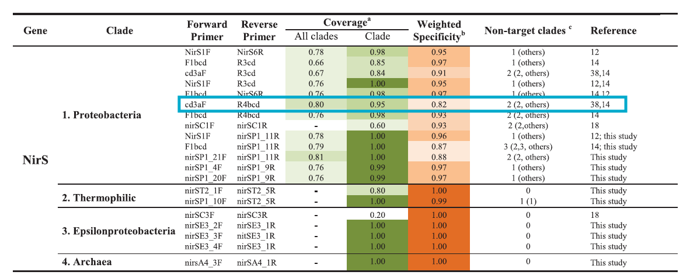
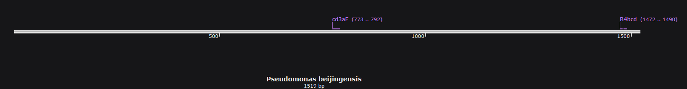

```{=html}
<style>
pre code, pre, code {
  white-space: pre !important;
  overflow-x: scroll !important;
  word-break: keep-all !important;
  word-wrap: initial !important;
}
</style>
```

# Introduction

Hello welcome to my laboratory notebook! This document will serve as my electronic notebook for my wet lab work while I am with the Schmidt Lab during my New Visions internship.

# February

## 2/11/2025

### Purpose

Learning how to pipette from Sophia

### Results

Pipetting was successful! I can pipette and will be ready to begin PCR either next week or in the distant future after my February break.

# March

## PCR 1

## PCR 2

## Multi-channel pipetting

# April

## Choosing primers and gBlock

### **Primer set #1: cd3aF** and **R3cd**

#### cd3aF (GTSAACGTSAAGGARACSGG, annealing temp = 49.7)

#### R3cd (GASTTCGGRTGSGTCTTGA, annealing temp  = 51.5)

---

First I tested cd3aF and R3cd, as this pair was suggested by [Throback
(2004)](https://pubmed.ncbi.nlm.nih.gov/19712290/). **cd3aF and R3cd
paired to my reference, *pseudomonas aeruginosa*, from NCBI.** The
**reverse primer did not pair with my next test** Pseudomonas,
*pseudomonas citrulli*, which had an 88% query cover and 84% identity on
NCBI. My third trial, *Pseudomonas beijingensis* (89% query cover, 83%
identity), paired with the forward primer again, but did not with the
reverse primer; this time, it initially worked and I ran into trouble
when I tried to "reverse complement" the sequence.

{width="5in"}

### Primer set #2: cd3aF and R4bcd

##### R4bcd (CGTTGAAYTTRCCGGTSGG, annealing temp = 54.2)

---

This is a set I got from [Bonilla-Rosso et al.,
2016](https://www.nature.com/articles/srep39208):{width="6in"}

#### *Pseudomonas aeruginosa*


Okay... this looks fine.

#### *Pseudomonas citrulli*


#### *Pseudomonas beijingensis*



Okay!

#### ***Pseudomonas uvaldensis*** **(89% query cover, 79% identity)**


Let's go!!

---

### To sum it up:

-   I will be using **cd3aF** and **R4bcd** as my primers for *nirS*
    qPCR.

-   gBlock - ***Pseudomonas aeruginosa***:

    -   TCAGTACACGTCGTGCTGGGTGTTGTAGACGTTGAACTTACCGGTCGGGGTGATCAGCCGCGGGTCCTTG
        ACCACGGCCTTGAGCTTCAGGGTCTTGTCGTCCACCACCACCAGCGCGGAGCTGTCGTTCTTGCCGTTCC
        ACACCGAGAACCAGACTTCATCGCCGCGCTTGTTGTACTCGGGCTGCACCACCCGCTTGGCGCCTTCGCC
        GAGATCGGCCCATTCGGCGATCGGCAGCACCTGGTACTTGGCGTCGAGGTTCTTCAGGTCGAACACCGCG
        ACGCTCTGGCTGATCCTGGCGTCGGGGTTGAAGGTGGTGTCGACGTAGAGGTGCGAGGACTTCGGATGGG
        TCTTGATGAACAGCGAGCCGCCGCCCTGGCCCTGTAGTTCGGCGACTTTCTTCCAGGCGTACTGCGGATG
        GTTCTTCGGATCGGTGCCGATCAGCGAGATGCTGCCGTCGCCCAGGTGGCTGGTGCTCCACACCGGGCCG
        TACTTGGGATGCACGAAGTTGGCGCCACGCCCCGGGTGCGGGGTCTTGCCGACGTCGACCAGGGCCGACA
        GGCGACGGTCCTTGGAGTCGATCACGGCAACCTTGTTGGAGTTGTTGGCGGCGGTCATGAAGTAGCGGTG
        GCTGCTGTCCCAGCCGCCGTCGTGGAGGAACGGCGCCGCACCGATGCTGGTGACGGTGAGGTTGTCGATA
        TCCTTGTAGTTGACCAGCAGGACCTTGCCGGTCTCCTTCACGTTGACGATGAACTCGGGGTGCTCGTGGG
        AGGCGATGATCGCCGCCACGCGCGGTTCCGGGTGGTAGGTCTGGGTGTCTACGGTCATGCCGCGGGTGGA
        GACGATCTGCTTCGGTTCCAGGGTCTCGCCGTCCATGATCGCGAACTGCGGCGGCCAGTAGGCGCCGGCG
        ATGGTGTAGCGGTCCTCGTAGCCCTTGAACTTGGAGCTTTCCACCGAGCGCGCCTCGATGCCGATCTTGA
        TCTCGGCGACCTTGGTCGGCTCCTTGGCCCACAGGTCGATCATGTCGATCCGCGCGTCGCGGCCGATCAC
        CAGCAGGTAGCGGCCGGAAGCGGACATCCGCGAGATATGCACGGCATAGCCGGTATCGATGACCTTGACG
        ATCTTCTTGCTGTCGCCGTCGACCAGGGCGATCTGCCCGGCGTCGCGCAGGGTCACCGAGAACAGGTTGG
        GCAGGTCGAGGTCGTTGAGCTGTTTCTTCGGCCGGTCCTCCGGCTTCACCAGCACCTTCCACGATTCGCG
        CATCTCCGGCATGCCCCACTCCGGCGGTTGCGGCGGGGTGTGCTGGATGTACTTGGCCATCAGGGTGATC
        TGTTCCTTGCTCAGCTCGCCGGAGCTGCCCCAGTTCGGCATGCCCAGCGGGGTGCCGTAGGTGATCAGCG
        CTTCCAGGTATTGCTGGCCGCGTTGCTGGGTGATGTCCGGGGTCAGCGGCTTGCCGGTGGCGCCCTTGCG
        CAGGACGCCGTGGCAACCGGCGCAGCGTTGGAAGTAGATCTGCTTGGCCTCGTTGAACTCGCTTTCACTC
        ATGTCGGGGGCACCGTTGGTGCGCACCACGTGAGCGGGATCGACGGCGGAAGCGGCACCCTGGTATTGCT
        CGGCGGCTTTCATGTCGTCCTTGGCGTGAGCGGTGGCCAGGCCCAGCAGCGTCAGCGAGGCGAGCAAGGT
        GCCCACCAGTGGCTTGCCAAATGGCAT

-   Accession #: **NC_002516.2**


